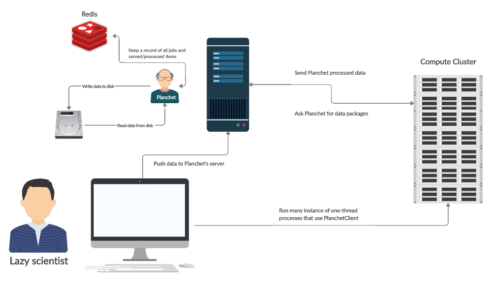

👋 Introduction
=================
Planchet (pronounced /plʌ̃ʃɛ/) is a data package manager suited for processing
large arrays of data items. It supports natively reading and writing into
CSV and JSONL data files and serving their content over a FastAPI service to
clients that process the data. It is a tool for scientists and hackers, not
production.

How it works
^^^^^^^^^^^^
Planchet attempts to solve the problem of controlled processing of large
amounts of data in a simple and slightly naive way. It controls the reading
and writing of the data and leaves the processing to the user. The usage takes
roughly the following shape:

- You start by creating a job which specifies where to read, where to write, and what classes to use for that.
- Then, you ask for `n` data items, which your process works through locally.
- When your processing is done, you send the items back to the service to be written to disk.

All jobs and item statuses are logged by the system which assures that if
the process or even the service is interrupted, only in-flight data processing
will be lost.

Constraints
^^^^^^^^^^^

**Single thread:** Planchet is running in a single thread to avoid the mess of multiple
processes writing in the same file. Until this is fixed (may be never) you
should be careful with your batch sizes -- keep them big enough to avoid
overwhelming the service with requests but not too big so that you avoid
request timeouts.

**Independence:** this tool was built in mind with independence of the data
points. What that means is that if you are processing a CSV, you don't need
line 1 to process line 2. Technically, even in that case you could implement
something using Planchet, but the logic on the client side will not be pretty 👹.
